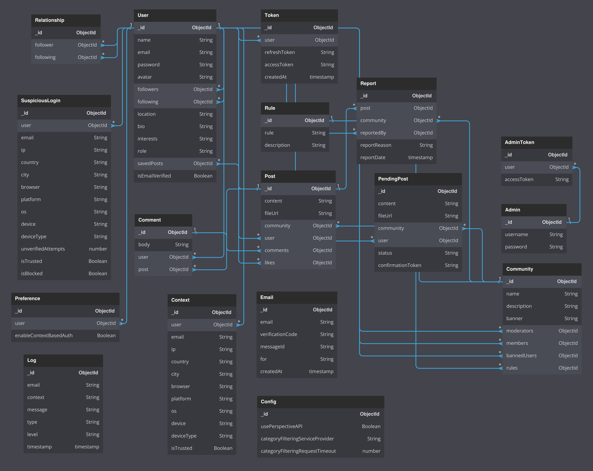

# Sphere Engage

A social networking platform analyzed, deployed, documented, and extended as part of a software engineering and database systems study.

---

## Project Background

**Sphere Engage** is based on the open-source **SphereEngage** project and was studied as part of an academic analysis of large-scale MERN applications.

The purpose of this repository is not to claim authorship of the original implementation, but to document and analyze the architecture, database design, authentication mechanisms, deployment workflow, and containerization aspects of the system.

### Acknowledgement

This project was developed by referring to the open-source SphereEngage project:
The repository was used for educational and analytical purposes including system study, architecture evaluation, deployment analysis, database modeling, authentication workflow analysis, and feature experimentation.

---

## Objectives of the Study


* MERN Stack Architecture
* Authentication and Authorization using JWT
* Refresh Token Mechanisms
* Database Design and Relationships
* Community-Based Social Network Architecture
* Content Moderation Pipelines
* State Management using Redux
* REST API Design
* Context-Based Authentication
* Deployment and Environment Configuration
* Docker and Containerization Concepts
* Software Maintenance and Debugging

---

## Key Areas of Contribution

The study and modifications focused on:

### Database Architecture

* User Schema Analysis
* Community Schema Analysis
* Post and Comment Relationships
* Report and Moderation Workflows
* Authentication Data Modeling
* Entity Relationship Mapping

### Authentication Study

* JWT Authentication
* Refresh Token Workflow
* Context-Based Authentication
* Device-Based Verification
* Session Management
* Security Analysis

### Deployment and Configuration

* Local MERN Deployment
* MongoDB Configuration
* Environment Variable Management
* Dependency Resolution
* Runtime Debugging

### Containerization Analysis

* Docker-Based Deployment Study
* Multi-Service Application Architecture
* Container Networking Concepts
* Environment Isolation
* Service Dependency Management

### Software Maintenance

* Dependency Conflict Resolution
* Redux Store Initialization Debugging
* Authentication Workflow Fixes
* Environment Configuration Fixes
* Build and Deployment Testing

---

## System Architecture

```text
┌─────────────────────────────┐
│         React Client        │
│  React + Redux + Tailwind   │
└──────────────┬──────────────┘
               │
               ▼
┌─────────────────────────────┐
│      Express.js Server      │
│     REST API Endpoints      │
└──────────────┬──────────────┘
               │
      ┌────────┴────────┐
      ▼                 ▼
┌─────────────┐   ┌─────────────┐
│  MongoDB    │   │ Auth Layer  │
│  Database   │   │ JWT Tokens  │
└─────────────┘   └─────────────┘
      │
      ▼
┌─────────────────────────────┐
│ Content Moderation Services │
│ Perspective / TextRazor /   │
│ HuggingFace / Flask Model   │
└─────────────────────────────┘
```

---

## Features

### User Features

* User Registration
* Login and Authentication
* Profile Management
* Follow / Unfollow Users
* Community Participation
* Post Creation
* Commenting System
* Like System

### Moderation Features

* Post Reporting
* Manual Moderation
* Community Moderation
* Automated Content Filtering

### Administrative Features

* Admin Dashboard
* Moderator Management
* Community Management
* User Monitoring

### Security Features

* JWT Authentication
* Refresh Token Management
* Device Management
* Context-Based Authentication
* Email Notifications

---

## Technology Stack

### Frontend

* React.js
* Redux Toolkit
* React Router
* Tailwind CSS
* Axios

### Backend

* Node.js
* Express.js
* MongoDB
* Mongoose

### Authentication

* JWT
* Passport.js

### Communication

* Nodemailer

### Moderation Services

* Perspective API
* TextRazor
* HuggingFace BART Large MNLI
* Flask Classifier Service

### Deployment & Infrastructure

* Docker
* MongoDB
* Environment Configuration

---

## Database Schema

The original database schema used in the reference implementation is preserved for architectural analysis.



---

## Project Structure

```text
Sphere_Engage
│
├── client/
│   ├── public/
│   ├── src/
│   │   ├── components/
│   │   ├── pages/
│   │   ├── redux/
│   │   ├── hooks/
│   │   ├── services/
│   │   ├── middleware/
│   │   └── utils/
│   │
│   └── package.json
│
├── server/
│   ├── controllers/
│   ├── middleware/
│   ├── models/
│   ├── routes/
│   ├── services/
│   ├── utils/
│   └── package.json
│
├── classifier_server/
│   ├── app.py
│   ├── models/
│   └── requirements.txt
│
├── resources/
│   └── Schema-Diagram.png
│
├── docker/
│
├── README.md
└── .env
```

---

## Installation

### Clone Repository

```bash
git clone https://github.com/prateeksha-bhat-2508/Sphere_Engage.git
cd Sphere_Engage
```

### Install Dependencies

Client

```bash
cd client
npm install
```

Server

```bash
cd server
npm install
```

### Environment Configuration

Create a `.env` file inside the server directory.

Example:

```env
CLIENT_URL=http://localhost:3000
MONGODB_URI=mongodb://127.0.0.1:27017/db_socialecho

PORT=4000

SECRET=your_secret
REFRESH_SECRET=your_refresh_secret

CRYPTO_KEY=your_crypto_key
```

### Start Backend

```bash
cd server
npm start
```

### Start Frontend

```bash
cd client
npm start
```

---

## Docker and Containerization Study

This project was also used to study containerization concepts, including:

* Application Isolation
* Environment Consistency
* Service Dependency Management
* Backend and Database Separation
* Multi-Service Architecture
* Docker-Based Deployment Workflows

The containerization study focused on understanding how large-scale web applications can be packaged, deployed, and managed consistently across environments.

---

## Educational Purpose

This repository is maintained for educational and analytical purposes.

Primary areas of study include:

* Database Architecture
* Authentication Systems
* MERN Application Design
* Content Moderation Architecture
* Containerization Concepts
* Deployment Strategies
* Software Maintenance and Debugging

---

## License

The original reference implementation is licensed under the MIT License.
## System Architecture


